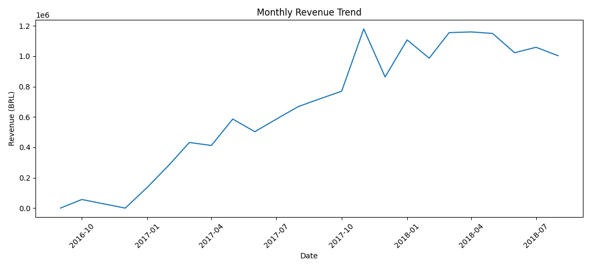
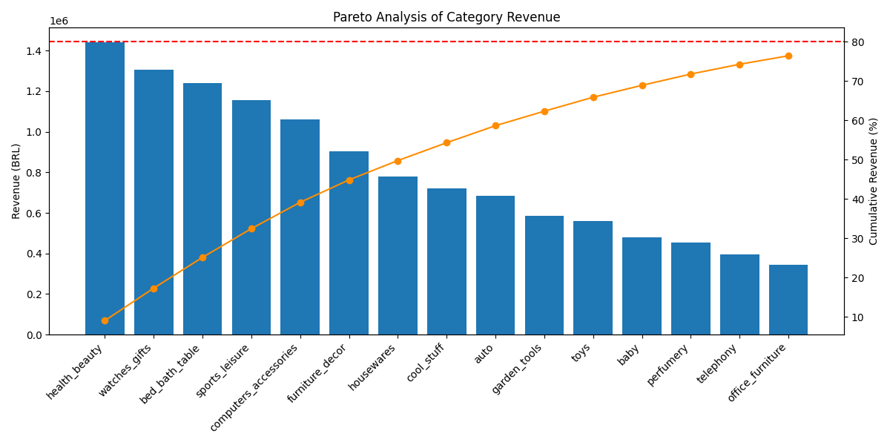
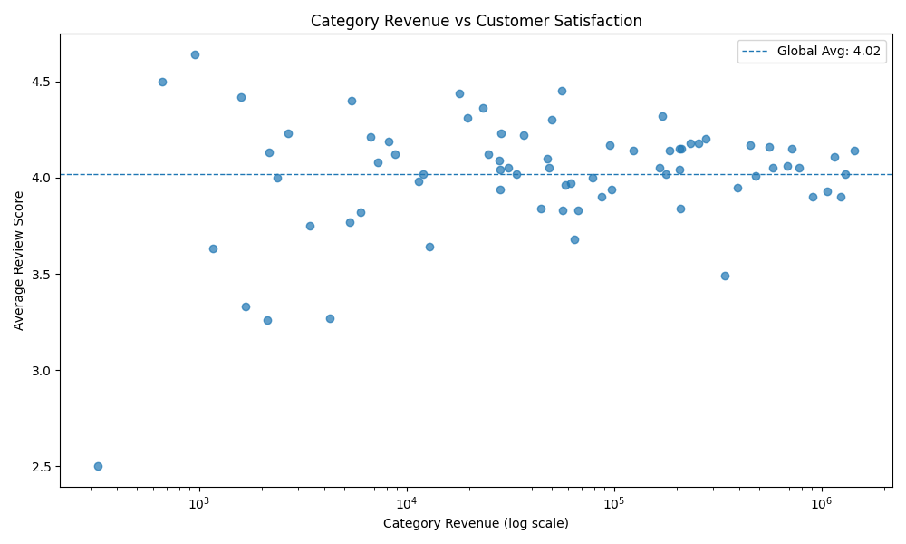

# E-commerce Revenue & Customer Behavior Analysis

## 🚀 Key Insight

High revenue does not always mean a healthy business.

This project reveals how **top-performing categories can hide serious customer experience issues**, impacting customer retention and long-term business performance.

---

## 🎯 Objective

Identify:

- Where revenue is generated  
- Which customers drive it  
- Where hidden risks exist  

And answer:

👉 *Are we growing sustainably, or masking problems behind strong revenue?*

---

## 📌 Key Technical Highlights

- Advanced SQL (CTEs, window functions, aggregations)
- Customer segmentation using RFM (NTILE)
- Pareto analysis (cumulative revenue distribution)
- Root cause analysis using customer reviews
- End-to-end workflow: SQL → CSV → Python → Visualization

---

## 📊 Key Visuals

### Revenue Trend


### Pareto Distribution


### Revenue vs Customer Satisfaction


---

## 🧠 Business Problem

High revenue can be misleading.

In e-commerce, some products or categories:

- Generate significant revenue  
- While simultaneously creating poor customer experience  

This leads to:

- Returns and refunds  
- Customer churn  
- Long-term brand damage  

**Goal:**  
Detect high-revenue areas with hidden experience issues and understand their root causes.

---

## 📦 Dataset

- Brazilian e-commerce dataset (Olist)
- Tables used:
  - orders
  - customers
  - order_items
  - products
  - order_reviews

Key fields:

- `customer_unique_id` → real customer identifier  
- `price + freight_value` → revenue  
- `review_score` → customer satisfaction  
- `product_category_name` + translation lookup → product category normalization 

---

## ⚠️ Methodological Note

Olist reviews are linked to orders rather than individual products.  
For this reason, product- and category-level customer experience analysis uses order reviews as a proxy. This is acceptable for exploratory analysis, but results should be interpreted with appropriate caution.

---

## 🔍 Analysis Workflow

### 1. Revenue Overview
- Monthly revenue trend  
- Growth patterns over time  

---

### 2. Pareto Analysis (80/20)
- Revenue distribution by category  
- Identification of top-performing categories  

**Insight:**  
A small number of categories drives the majority of total revenue.

---

### 3. Customer Segmentation (RFM)

Customers segmented using:

- Recency  
- Frequency  
- Monetary  

Main segments:

- Champion  
- Big Spender  
- Others  

Focus on high-value customers.

---

### 4. Segment Behavior Analysis

Different behavior patterns:

- Champions → more **home & lifestyle categories**  
- Big Spenders → more **tech & impulse-driven categories**

---

### 5. Customer Experience Analysis

- Revenue vs review score by category  

👉 Detection of:

**High revenue + low satisfaction categories**

---

### 6. Problematic Category Detection

Category identified:

- `bed_bath_table`

Why:

- High revenue contribution  
- Below-average satisfaction  

---

### 7. Product-Level Root Cause Analysis

Analysis of a high-revenue product revealed:

- Incorrect size / dimensions  
- Misleading product descriptions  
- Delivery issues  
- Poor perceived quality  

These issues appear even among:

- Champion customers  
- Big Spenders  

---

## 💡 Key Insights

- Revenue follows a **Pareto distribution**  
- High-value customers behave differently  
- High-revenue categories can hide **critical experience issues**  
- Customer reviews expose **operational problems invisible in aggregate data**

---

## 🧩 Business Recommendations

- Improve product description accuracy  
- Strengthen quality control  
- Improve logistics reliability  
- Monitor high-revenue / low-satisfaction products  
- Prioritize experience for high-value customers  

---

## ⚙️ Tech Stack

- SQL (PostgreSQL)
- Window functions (NTILE, RANK, SUM OVER)
- CTE-based transformations
- Python (pandas, matplotlib)

---

## 📁 Project Structure

```text
sql/        -> analytical queries
data/       -> exported datasets (CSV)
outputs/    -> charts
notebooks/  -> analysis and visualization
```

---

## 💼 Why this project matters

This project demonstrates:

- Ability to work with real-world messy data  
- Strong SQL applied to business problems  
- End-to-end analytical thinking (data → insight → decision)  
- Root cause analysis beyond dashboards  

It shows how data can be used not only to measure performance, but to **identify hidden risks and drive better decisions**.

---

## 📈 Visualizations Included

- Revenue trend over time  
- Pareto distribution  
- Customer segmentation  
- Revenue vs satisfaction  
- Segment category comparison  
- Product-level issue analysis  
