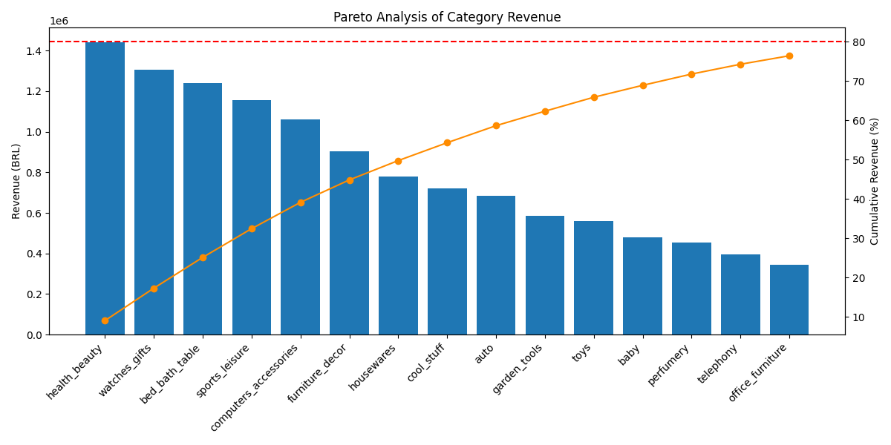
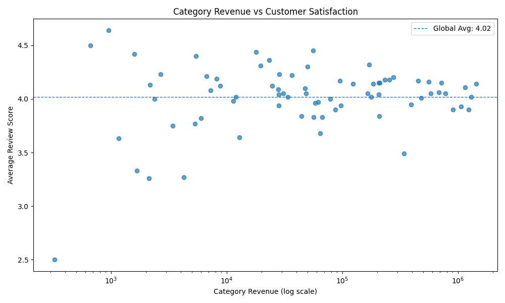
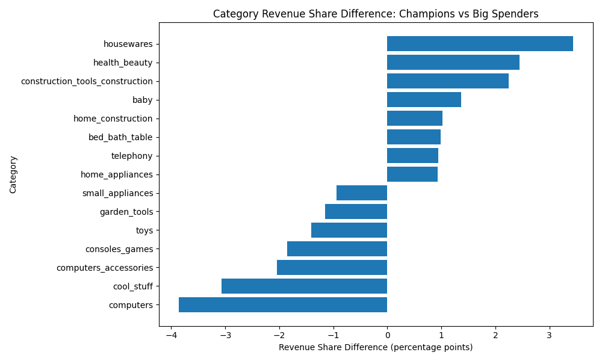
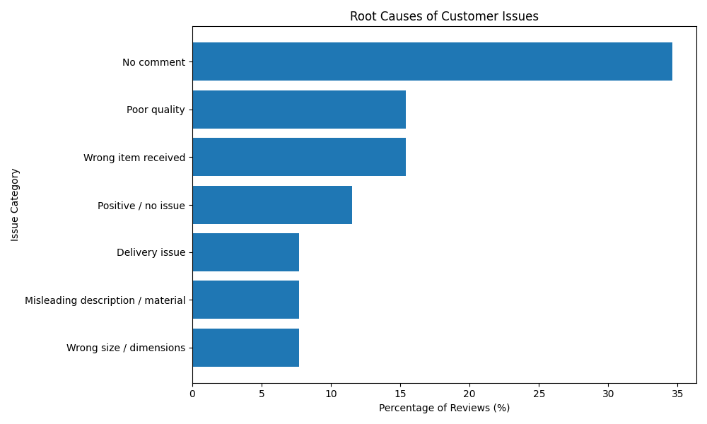

# E-commerce Revenue & Customer Behavior Analytics

## 🚀 Project Overview

High revenue does not always mean a healthy business.

This project explores the Brazilian Olist e-commerce dataset to understand how customer behavior, product performance, and customer experience interact to drive business outcomes.

The goal is not only to identify where revenue comes from, but also to uncover hidden operational risks that may affect long-term business performance.

---

## 🎯 Business Questions

This project aims to answer:

- Which categories generate the most revenue?
- Which customer segments drive business growth?
- Do high-revenue categories always deliver a good customer experience?
- Can customer reviews reveal hidden operational issues?
- How can data support better business decisions?

---

## 🧠 Key Insights

- Revenue follows a Pareto distribution.
- High-value customers exhibit different purchasing behaviours.
- High-revenue categories can hide customer experience issues.
- Customer reviews reveal operational risks invisible in aggregate metrics.
- Root cause analysis helps transform raw data into actionable business insights.

---

## 📊 Featured Visualizations

### Pareto Revenue Distribution

Identifies the categories responsible for the largest share of total revenue.



---

### Revenue vs Customer Satisfaction

Highlights categories where strong revenue may hide customer experience problems.



---

### Champions vs Big Spenders

Compares purchasing behaviour between high-value customer segments.



---

### Root Causes of Customer Issues

Drills down into customer reviews to identify the main drivers of dissatisfaction.



---

## ⚙️ Tech Stack

- SQL (PostgreSQL)
- CTEs and Window Functions
- RFM Customer Segmentation
- Python
- Pandas
- Matplotlib
- Business Analytics
- Data Visualization
- Root Cause Analysis

---

## 📁 Repository Structure

```text
sql/
data/
outputs/
notebooks/
```

- **sql/** → analytical SQL queries
- **data/** → exported datasets
- **outputs/** → visualizations
- **notebooks/** → Python analysis and chart generation

---

## 💼 What This Project Demonstrates

This project demonstrates:

- Advanced SQL applied to real business problems.
- Customer segmentation using RFM analysis.
- End-to-end analytical workflows.
- Data transformation and visualization.
- Root cause analysis beyond traditional dashboards.
- The ability to convert raw data into actionable business insights.
- A Data Engineering mindset combining technical implementation with business understanding.

---

## 📈 Project Highlights

- Revenue trend analysis
- Pareto analysis
- RFM customer segmentation
- Customer segment behaviour
- Revenue vs customer satisfaction
- Problematic category detection
- Product-level root cause analysis
- Business recommendations based on data